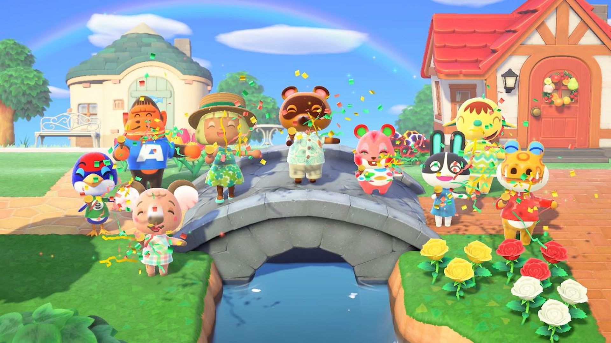
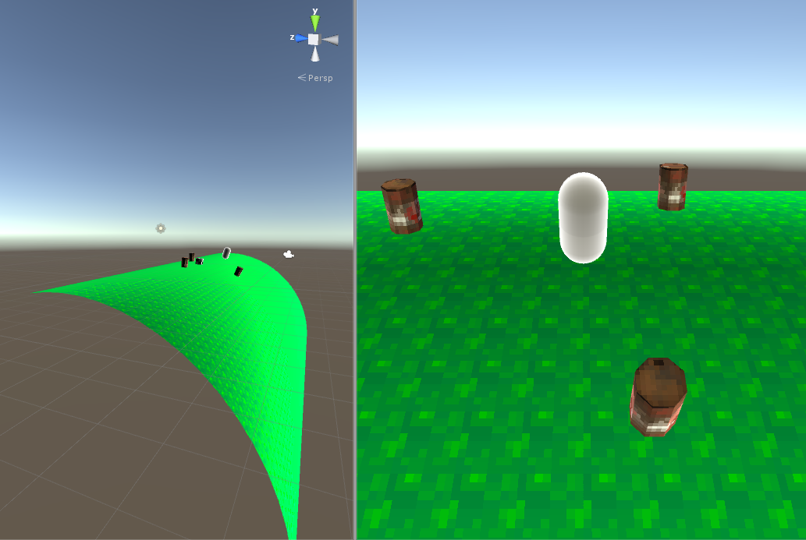

# Case Study: Animal Crossing Cyclindrical World Shader

This project was created to explore how to visually wrap a flat world around a cylinder using Vertex Shaders in Unity.

Reference:

Result:

